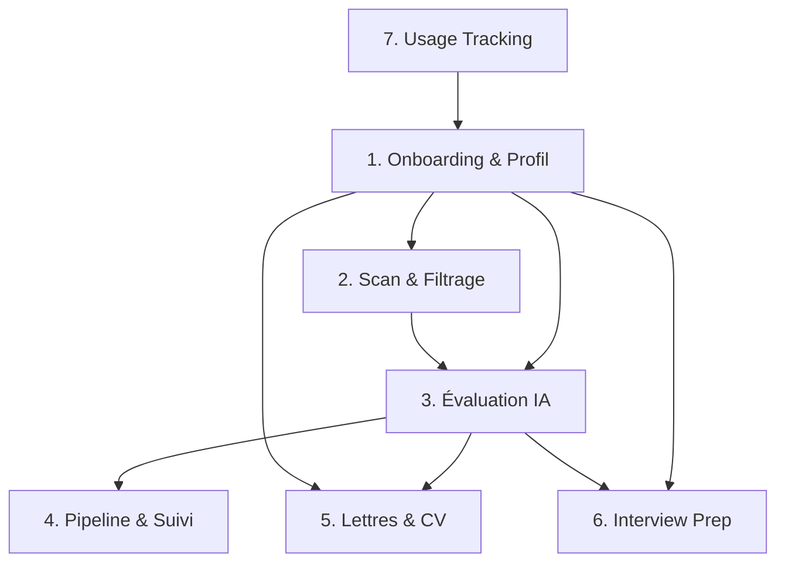

# Architecture Globale : La Plateforme Web "Job-Tracker" x "Career-Ops"

Ce document définit le plan directeur (Master Plan) pour transformer `job-tracker` en une **plateforme web centralisée et intuitive** de "Career Operations". L'objectif final est de démocratiser l'intelligence de *career-ops* : les utilisateurs accèdent à toute la puissance du système directement depuis une interface graphique (Next.js), sans jamais avoir à toucher un terminal ou configurer des fichiers en local.

> **Ref.** : Ce document est le volet *produit* (quoi construire). Le volet *technique* (comment construire) est dans `SYSTEM_ARCHITECTURE.md`.

---

## 1. Fondation : L'Onboarding UI & Le Profil Candidat Numérique
Plutôt que des fichiers statiques locaux, la plateforme gère dynamiquement l'espace de chaque utilisateur via MongoDB (approche multi-comptes).

*   **Le Portail d'Onboarding (Interface Next.js)** :
    *   **Préférences & Ciblage** : Des formulaires interactifs permettent à l'utilisateur de définir le poste visé, les prétentions salariales, la zone géographique de recherche, le statut de visa et les filtres (mots-clés / technos à exclure).
    *   **Chargement des Ressources** : Interface pour uploader un CV (automatiquement parsé et converti en Markdown) et renseigner les URLs importantes (Portfolio, GitHub, LinkedIn, projets).
*   **Le Moteur Backend (FastAPI)** :
    *   Le backend traite ces inputs UI et consolide automatiquement un objet "Profil" structuré (l'équivalent dynamique des fichiers `profile.yml` et `cv.md` de career-ops).
    *   Ce profil (le *Single Source of Truth* du candidat) est rattaché de façon sécurisée au compte du user dans MongoDB. Il est ensuite injecté comme contexte de référence à chaque Agent IA lors de l'évaluation ou de la rédaction.

### Déjà implémenté ✅
| Composant | Fichier(s) | Notes |
|---|---|---|
| Modèle `CandidateProfile` | `app/models.py` (L364-381) | Expériences, projets, éducation, certifications, skills, provenance, conflits |
| Parsing CV → Profil | `app/services/cv_parser.py` | Extraction texte PDF + parsing LLM |
| Collecteur GitHub | `app/services/profile/collectors/github.py` | Scrape repos et contributions |
| Collecteur Website | `app/services/profile/collectors/website.py` | Scrape portfolio |
| Fusion multi-sources | `app/services/profile/merge.py` | Merge avec résolution de conflits et provenance |
| API profil (CRUD) | `app/routers/cover_letters.py` (routes `/profile/candidate/*`) | GET, PUT, POST sources |
| Route `/profile` (UI) | `frontend/src/app/profile/` | Interface de gestion du profil |

### Déjà implémenté ✅
| Composant | Fichier(s) | Notes |
|---|---|---|
| Modèle `CandidateProfile` | `app/models.py` | Expériences, projets, éducation, certifications, skills, Voice DNA (`writing_style`) |
| Parsing CV → Profil | `app/services/cv_parser.py` | Extraction PDF + parsing VLM Mistral |
| Collecteur GitHub | `app/services/profile/collectors/github.py` | Scrape repos, contributions et filtrage des repos triviaux |
| Collecteur Website | `app/services/profile/collectors/website.py` | Scrape portfolio et pages internes |
| Fusion multi-sources | `app/services/profile/merge.py` | Merge dédupliqué (`_normalize_key`), résolution de conflits et provenance |
| Portail Onboarding (UI) | `frontend/src/app/onboarding/` | Wizard multi-étapes : ciblage, upload CV, sources externes |
| Préférences de ciblage | `frontend/src/components/profile/` | Sélection multi-niveaux de séniorité, prétentions, télétravail |
| Route `/profile` (UI) | `frontend/src/app/profile/` | Single Source of Truth, CRUD complet, conteneurs scrollables |

---

## 2. Phase de Découverte : Le Scan & Filtrage ("Scan")
Le but est de cesser de collecter du bruit et de détecter immédiatement les offres expirées (ex: offre OVH sur WTTJ).

*   **Liveness Gate (Filtre de viabilité)** :
    *   Lors du crawl, vérifier les codes HTTP (404/410), les redirections forcées, et la présence de textes comme *"Cette offre n'est plus disponible"*.
    *   Action : Marquer `pipeline_stage: "expired"` dans MongoDB et synchroniser avec les candidatures liées.
*   **Zero-Token ATS Parsers & Routeur JSON-LD** :
    *   Cibler les API publiques d'ATS (Greenhouse, Lever, Workable) et le balisage Schema.org (`JobPosting` pour Ashby, Teamtailor, Personio, Recruitee) pour extraire du JSON propre à coût token nul avant Crawl4AI.
*   **Funnel de recherche équilibré CrewAI** :
    *   Stratégie d'entonnoir additif en 3 passes (Job Boards nationaux, Portails & ATS direct entreprises, LinkedIn Jobs).
*   **Pipeline de normalisation en 4 couches** :
    *   Nettoyage syntaxique, extraction de séniorité, déduplication floue Levenshtein + Jaccard de description, et fusion multi-sources avec priorité ATS.

### Déjà implémenté ✅
| Composant | Fichier(s) | Notes |
|---|---|---|
| Zero-Token ATS Parsers & JSON-LD | `app/services/ats/router.py` | Connecteurs directs Greenhouse, Lever, Workable, Schema.org |
| Funnel de recherche CrewAI | `job_trackers/src/job_trackers/tools/custom_tool.py` | 3 passes équilibrées (Boards nationaux 12, ATS direct 10, LinkedIn 8) |
| Normalisation en 4 couches | `app/services/normalization.py` | Syntaxe, séniorité, Levenshtein/Jaccard, fusion multi-sources |
| Normalisation des rôles | `app/services/role_normalizer.py` | 24 rôles tech canoniques, embeddings cosinus >= 0.85 |
| Demand-Driven Scraping | `app/tasks/job_offers_collectors.py` | Requêtes dynamiques depuis les préférences candidats |
| Découplage Multi-Tenant | `app/models.py`, `app/routers/job_offers.py` | Collection `user_offer_interactions` (saved, hidden, applied) |
| Vérification liveness & protection | `app/tasks/verify_job_offers.py`, `clean_job_offers.py` | Protection des offres liées aux candidatures, passage en expired |

---

## 3. Phase d'Analyse : L'Auto-Pipeline d'Évaluation ("Evaluation")
Chaque offre viable passe par un sas d'évaluation IA avant d'apparaître sur l'écran de l'utilisateur.

*   **Two-Pass Rule (Règle des 2 passages)** :
    1. L'Agent lit la description du poste seule et extrait les exigences pondérées (`critical`, `high`, `meaningful`).
    2. L'Agent lit le profil candidat complet (expériences, stack, formations, projets GitHub) et effectue le matching.
*   **Les Blocs d'Évaluation (A à G)** :
    *   *Bloc A* : Résumé, Archétype du poste, et Drapeaux Rouges (Geo-mismatch, Sponsoring refusé).
    *   *Bloc B* : Le Match CV vs Offre (avec citations *verbatim* obligatoires et distinction des preuves déclarées vs déduites).
    *   *Bloc G* : Détection des arnaques et offres republiées (Ghost jobs).
*   **Action** : Génération d'un **Score de 1.0 à 5.0**. Stocké dans `offer_evaluations` et `JobOffer.evaluation_score`.
*   **Transition d'état** : `JobOffer.pipeline_stage` passe de `discovered` à `evaluated`.

### Déjà implémenté ✅
| Composant | Fichier(s) | Notes |
|---|---|---|
| Modèles d'évaluation | `app/models.py` | `OfferEvaluationInDB`, `RequirementMatch`, `MissingRequirement` |
| Évaluateur Two-Pass (Gemini 3.7 Flash) | `app/services/evaluation/evaluator.py` | Blocs A-G, vérification quotas API, scoring déterministe |
| Endpoints d'évaluation | `app/routers/job_offers.py` | POST `/job-offers/{id}/evaluate`, GET `/job-offers/{id}/evaluation` |
| UI de consultation détaillée | `frontend/src/app/offers/[id]/page.tsx` | Jauge de score, citations verbatim, points forts/bloquants |
| Évaluation in-sidebar Kanban | `frontend/src/components/applications/ApplicationDetails.tsx` | Évaluation en 1 clic directement dans la sidebar |

---

## 4. Phase de Pilotage : Vue Pipeline & Suivi ("Summarize Statuses")
L'interface de `job-tracker` (Next.js) propose un **Kanban de Matching et de Candidatures**.

*   **State Machine Unifiée** :
    *   Offer Pipeline : `discovered` → `evaluated` → `expired`.
    *   Application Pipeline : `applied` → `screening` → `interview` → `technical_test` → `negotiation` → `offer_received` / `rejected` / `withdrawn`.
*   **Filtrage personnalisé** :
    *   Filtre par score minimum (`min_score >= 4.0`), bascule favoris / offres sauvegardées.
*   **Cadences Automatisées (Follow-up)** :
    *   `applied` + 7 jours -> Badge alerte "Relance à faire".
    *   `interview` + 1 jour -> Badge alerte "Email de remerciement".
*   **Vue Summarize & KPIs** :
    *   Taux de conversion entretien et offre, offres prêtes à postuler, relances en souffrance.

### Déjà implémenté ✅
| Composant | Fichier(s) | Notes |
|---|---|---|
| Route unifiée `/applications` (UI) | `frontend/src/app/applications/` | Switcher Kanban / Tableau, colonnes scrollables indépendantes |
| Métriques & Conversion | `app/routers/applications.py` | Endpoint `/applications/summary` (KPIs, conversions) |
| Cadences J+7 / J+1 | `frontend/src/components/applications/` | Badges visuels d'échéance et alerte |
| Redirection `/pipeline` | `frontend/src/app/pipeline/page.tsx` | Redirection transparente vers `/applications` |

---

## 5. Phase d'Action : Lettres de Motivation & CV Sur-Mesure
Lorsqu'une offre est validée par l'utilisateur (Score >= 4.0).

*   **Génération de CV (Tailored ATS PDF)** :
    *   Un Agent réordonne et adapte les termes du profil candidat pour refléter la nomenclature de l'offre (ex: "Cloud" devient "AWS" si pertinent), sans jamais mentir.
    *   Export en PDF ultra-sobre et optimisé pour le parsing des robots ATS.
*   **Lettre de Motivation (Pipeline Multi-Agents LiteLLM)** :
    *   Pipeline séquentiel de 4 agents : `offer_analyst` (gpt-5.6-luna) → `writer` (gpt-5.6-sol) → `critic` (gemini-3.8-flash, cross-provider) → `reviser` (gpt-5.6-sol, conditionnel).
    *   Letter Guards en code pur (ponctuation, mots bannis, longueur) + critique inter-modèle.
    *   Alimenté avec le profil candidat et la description de l'offre.
    *   Coût : ~$0.04-0.08 par lettre.

> **Orchestrateur** : FastAPI `BackgroundTasks` (tâche user-triggered).
>
> **Dépendance** : Phase 1 (profil candidat) et Phase 3 (évaluation / Bloc B).

### Déjà implémenté ✅
| Composant | Fichier(s) | Notes |
|---|---|---|
| Pipeline 4 agents LiteLLM | `job_trackers/cover_letter_crew.py` | analyst → writer → critic → reviser |
| Configuration modèles par rôle | `job_trackers/letter_llm.py` | Modèles épinglés, cross-provider obligatoire |
| Letter Guards (code pur) | `app/services/letter_guards.py` | Ponctuation, mots bannis, longueur |
| API cover letter (CRUD + regen) | `app/routers/cover_letters.py` | GET, POST regen, PATCH edit |
| Background generation | `app/routers/applications.py` | `_generate_cover_letter_bg()` via BackgroundTasks |
| Versioning cover letters | `app/models.py` (CoverLetter/CoverLetterVersion) | guard_report, critic_verdict, models used |
| CV Tailoring IA (Bloc B fusion) | `app/services/cv_tailor.py` | Alignement offre + Bloc B, verbes d'action, métriques |
| Garde-fous anti-hallucination CV | `app/services/cv_guards.py` | Vérification stricte des entreprises et compétences réelles |
| Modèles A4 Européens (Jinja2 + CSS) | `app/templates/cv/` | `sidebar_elegance` & `executive_minimalist` (CECRL, typographie Inter) |
| Rendu PDF vectoriel A4 | `app/services/cv_pdf_renderer.py` | Playwright headless Chromium, texte vectoriel sélectionnable |
| API REST CV & Quotas | `app/routers/resumes.py` | CRUD, `/generate`, streaming `/pdf`, tracking `cv_tailoring` |
| Hub Frontend `/resumes` | `frontend/src/app/resumes/` | Galerie de cartes, modal d'aperçu PDF, switcher de template, téléchargement 1-clic |

### Reste à faire ⬜
- Aucun (Phase 5 100% complétée)

---

## 6. Phase Finale : Préparation d'Entretien ("Interview Prep & STAR+R")
Lorsque le statut passe à "Entretien programmé" (`interview`).

*   **Génération du Plan d'Attaque (STAR+R)** :
    *   L'IA analyse le "Bloc B" (les exigences de l'offre) et sélectionne dans le profil candidat les 3 à 5 meilleures histoires (Situation, Task, Action, Result + Reflection) à raconter.
*   **Anticipation des Questions** :
    *   Génération d'une liste des questions comportementales ("Behavioral") et techniques les plus probables pour cette fiche de poste précise.
*   **Détection des Red-Flags Employeur** :
    *   Génération d'une liste de questions à poser au recruteur pour vérifier la santé du projet/équipe (ex: *"Quel est le budget alloué à l'IA cette année ?"*).

> **Dépendance** : Phase 3 (évaluation / Bloc B) et Phase 1 (profil candidat avec expériences détaillées).

### Reste à faire ⬜
- [ ] Agent STAR+R (sélection d'histoires dans le profil)
- [ ] Agent Questions Anticipées (comportementales + techniques)
- [ ] Agent Red-Flags Employeur
- [ ] Interface UI dans la vue `/offers/[id]` ou `/applications/[id]`

---

## 7. Transverse : Suivi de Consommation API & Monétisation

Système de tracking et de quotas pour contrôler les coûts LLM et permettre la monétisation SaaS.

*   **Tracking** : Chaque appel LLM est enregistré dans une collection `api_usage` (tokens, coût estimé, modèle, latence, succès/erreur).
*   **Quotas par Tier** :

    | | **Free** | **Advanced** (9.90€/mois) | **Pro** (24.90€/mois) |
    |---|---|---|---|
    | Lettres de motivation | 5/mois | 30/mois | Illimité |
    | Évaluations IA | 20/mois | 100/mois | Illimité |
    | CV Tailoring | 2/mois | 15/mois | Illimité |
    | Parsing CV | 2/mois | 10/mois | Illimité |
    | Interview Prep | 1/mois | 10/mois | Illimité |

*   **Guard Middleware** : Vérification du quota avant chaque action LLM. Réponse `429 Too Many Requests` si dépassement.
*   **Dashboard** : Route `/settings/usage` pour le suivi personnel, routes `/admin/usage` pour l'administration.

> **Dépendance** : Aucune — à implémenter en priorité (chaque jour sans tracking = coûts invisibles).

### Reste à faire ⬜
- [ ] Modèles `ApiUsageRecord`, `UserTier`, `UserQuota` dans `models.py`
- [ ] Module `app/llm/tracker.py` (callback LiteLLM + wrapper LangChain)
- [ ] Instrumentation des 3 stacks LLM existantes
- [ ] Router `app/routers/usage.py`
- [ ] Guard middleware `check_quota()`
- [ ] Route `/settings/usage` (UI)

---

## Dépendances Inter-Phases

**Ordre d'implémentation recommandé** : 7 → 1 (compléter onboarding) → 3 → 4 → 5 (compléter CV) → 6
