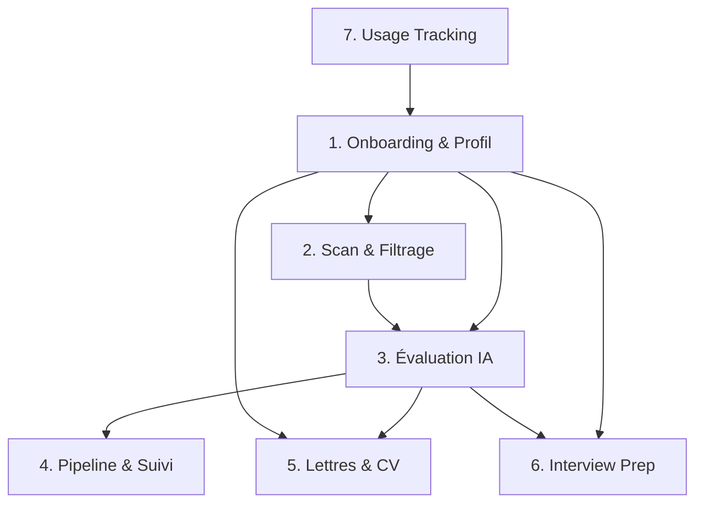

# Architecture Globale : La Plateforme Web "Job-Tracker" x "Career-Ops"

Ce document définit le plan directeur (Master Plan) pour transformer `job-tracker` en une **plateforme web centralisée et intuitive** de "Career Operations". L'objectif final est de démocratiser l'intelligence de *career-ops* : les utilisateurs accèdent à toute la puissance du système directement depuis une interface graphique (Next.js), sans jamais avoir à toucher un terminal ou configurer des fichiers en local.

> **Ref.** : Ce document est le volet *produit* (quoi construire). Le volet *technique* (comment construire) est dans `SYSTEM_ARCHITECTURE.md`.

---

## 1. Fondation : L'Onboarding UI & Le Profil Candidat Numérique
Plutôt que des fichiers statiques locaux, la plateforme gère dynamiquement l'espace de chaque utilisateur via MongoDB (approche multi-comptes).

*   **Le Portail d'Onboarding (Interface Next.js)** :
    *   **Préférences & Ciblage** : Des formulaires interactifs permettent à l'utilisateur de définir le poste visé, les prétentions salariales, la zone géographique de recherche, le statut de visa et les filtres (mots-clés / technos à exclure).
    *   **Chargement des Ressources** : Interface pour uploader un CV (automatiquement parsé et converti en Markdown) et renseigner les URLs importantes (Portfolio, GitHub, LinkedIn, projets).
*   **Le Moteur Backend (FastAPI)** :
    *   Le backend traite ces inputs UI et consolide automatiquement un objet "Profil" structuré (l'équivalent dynamique des fichiers `profile.yml` et `cv.md` de career-ops).
    *   Ce profil (le *Single Source of Truth* du candidat) est rattaché de façon sécurisée au compte du user dans MongoDB. Il est ensuite injecté comme contexte de référence à chaque Agent IA lors de l'évaluation ou de la rédaction.

### Déjà implémenté ✅
| Composant | Fichier(s) | Notes |
|---|---|---|
| Modèle `CandidateProfile` | `app/models.py` (L364-381) | Expériences, projets, éducation, certifications, skills, provenance, conflits |
| Parsing CV → Profil | `app/services/cv_parser.py` | Extraction texte PDF + parsing LLM |
| Collecteur GitHub | `app/services/profile/collectors/github.py` | Scrape repos et contributions |
| Collecteur Website | `app/services/profile/collectors/website.py` | Scrape portfolio |
| Fusion multi-sources | `app/services/profile/merge.py` | Merge avec résolution de conflits et provenance |
| API profil (CRUD) | `app/routers/cover_letters.py` (routes `/profile/candidate/*`) | GET, PUT, POST sources |
| Route `/profile` (UI) | `frontend/src/app/profile/` | Interface de gestion du profil |

### Reste à faire ⬜
- [ ] Route `/onboarding` (wizard multi-étapes)
- [ ] Formulaires de préférences (poste, salaire, géo, visa, filtres)
- [ ] Stockage des préférences de ciblage dans le profil MongoDB

---

## 2. Phase de Découverte : Le Scan & Filtrage ("Scan")
Le but est de cesser de collecter du bruit et de détecter immédiatement les offres expirées (ex: offre OVH sur WTTJ).

*   **Liveness Gate (Filtre de viabilité)** :
    *   Lors du crawl (Crawl4AI), vérifier les codes HTTP (404/410), les redirections forcées, et la présence de textes comme *"Cette offre n'est plus disponible"*.
    *   Action : Marquer `pipeline_stage: "expired"` dans MongoDB (rétrocompatible avec `is_deleted=True`).
*   **Zero-Token ATS Parsers** :
    *   Cibler les API publiques d'ATS (Greenhouse, Lever en priorité — Ashby est plus fermé) pour récupérer des flux JSON propres avant de tomber sur le fallback Crawl4AI.
*   **Filtres Chirurgicaux** :
    *   Appliquer une logique stricte sur les titres via le filtre de pertinence métier (allowlist data/IA/ML + blocklist métiers hors-domaine).
    *   Bannissement automatique des stacks non désirées.

> **Orchestrateur** : Airflow (DAGs existants pour le scraping quotidien, nettoyage batch, vérification liveness).

### Déjà implémenté ✅
| Composant | Fichier(s) | Notes |
|---|---|---|
| Vérification liveness offres | `app/tasks/verify_job_offers.py` | Détection 404/410, textes d'expiration |
| Nettoyage/normalisation offres | `app/services/normalization.py`, `app/tasks/clean_job_offers.py` | Normalisation ville, entreprise, déduplication |
| Filtrage pertinence métier | `app/services/relevance.py` | Allowlist data/IA + blocklist génie civil/BTP |
| Scraping CrewAI (3 agents) | `job_trackers/crew.py` | query_converter → search_executor → url_filter |
| Airflow DAGs | `airflow/dags/` | Orchestration batch |

### Reste à faire ⬜
- [ ] Support étendu des ATS mondiaux (Ashby, BambooHR, Personio, Workable, SuccessFactors, Taleo, iCIMS) dans `custom_tool.py` et `normalization.py`
- [ ] Pipeline de normalisation des titres en 4 couches (syntaxique, séniorité/canonique, fuzzy Jaccard, embeddings)
- [ ] Découplage des interactions utilisateur (`user_offer_interactions` : sauvegardes, masquages, match score)
- [ ] Refonte d'Airflow en Demand-Driven Scraping (agrégation des `SearchSubscriptions` des utilisateurs actifs)
- [ ] Zero-Token ATS Parsers (Greenhouse API, Lever API, Ashby API)
- [ ] Migration `is_deleted` → `pipeline_stage: "expired"` sur les offres existantes (avec protection des offres liées aux candidatures)
- [ ] Configuration des filtres par utilisateur (portals.yml → UI)

*(Référence détaillée : [`JOB_INGESTION_AND_NORMALIZATION.md`](./JOB_INGESTION_AND_NORMALIZATION.md))*

---

## 3. Phase d'Analyse : L'Auto-Pipeline d'Évaluation ("Evaluation")
Chaque offre viable passe par un sas d'évaluation IA avant d'apparaître sur l'écran de l'utilisateur.

> **But produit** : l'intérêt de brancher career-ops n'est pas seulement de calculer un score — c'est de le **rendre consultable par l'utilisateur**, avec le détail des blocs (A-G) qui explique *pourquoi* une offre matche ou pas (exigences manquantes, geo-mismatch, sponsoring refusé...). Un score sans détail consultable ne remplit pas l'objectif.

*   **Two-Pass Rule (Règle des 2 passages)** :
    1. L'Agent lit la description du poste seule et liste les exigences avec leur pondération (`critical`, `high`, `meaningful`).
    2. L'Agent lit ensuite le profil candidat (équivalent `cv.md`) et effectue le matching.
*   **Les Blocs d'Évaluation (A à G)** :
    *   *Bloc A* : Résumé, Archétype du poste, et Drapeaux Rouges (Geo-mismatch, Sponsoring refusé).
    *   *Bloc B* : Le Match CV vs Offre (avec citations *verbatim* obligatoires).
    *   *Bloc G* : Détection des arnaques et offres republiées (Ghost jobs).
*   **Action** : Génération d'un **Score de 1.0 à 5.0**. Stocké dans `JobOffer.evaluation_score`.
*   **Transition d'état** : `JobOffer.pipeline_stage` passe de `discovered` à `evaluated`.

> **Orchestrateur** : FastAPI `BackgroundTasks` (tâche user-triggered ou batch Airflow selon le volume).
>
> **Dépendance** : Phase 1 (profil candidat) et Phase 2 (offres scrapées viables).

### Déjà implémenté ✅
| Composant | Fichier(s) | Notes |
|---|---|---|
| Résumé d'offre via LLM | `app/llm/utils.py` | Résumé structuré via `gpt-5-nano` |

### Reste à faire ⬜
- [ ] Nouveau modèle `Evaluation` (ou champs sur `JobOffer`) : score, blocs A-G, exigences pondérées
- [ ] Agent d'évaluation Two-Pass (LiteLLM)
- [ ] Transition automatique `pipeline_stage: "discovered" → "evaluated"`
- [ ] Affichage par défaut limité aux offres Score >= 4.0
- [ ] **UI de consultation du score** sur la fiche offre (`/offers/[id]`) : score global visible immédiatement + détail dépliable des Blocs A-G (exigences non satisfaites avec citation verbatim, drapeaux rouges, résumé) pour que l'utilisateur comprenne ce qui ne matche pas

---

## 4. Phase de Pilotage : Vue Pipeline & Suivi ("Summarize Statuses")
L'interface de `job-tracker` (Next.js) se transforme en un Dashboard de Commandement structuré autour d'un **Kanban de Matching**.

*   **State Machine Unifiée à Deux Niveaux** :

    **Offer Pipeline** (automatique, sur `JobOffer.pipeline_stage`) :
    1. `discovered` : Offre collectée par Airflow, en attente du passage de l'Auto-Pipeline.
    2. `evaluated` : Offre évaluée avec un Score >= 4.0, en attente d'action (Personnalisation CV/Lettre).
    3. `expired` : Offre détectée comme expirée ou non-viable.

    **Application Pipeline** (utilisateur, sur `JobApplication.status`) :
    4. `applied` : Candidature envoyée (déclenche le compte à rebours pour la relance J+7).
    5. `screening` → `interview` → `technical_test` → `negotiation` : En processus de recrutement.
    6. `offer_received` / `rejected` / `withdrawn` : Clôture (alimente les statistiques de conversion).

    **Pont** : Bouton "Postuler" crée un `JobApplication` avec `offer_id` lié à l'offre scrapée.

*   **Filtrage par Score** :
    *   Affichage par défaut limité aux offres avec un Score >= 4.0.
*   **Cadences Automatisées (Follow-up)** :
    *   Génération de rappels basés sur le statut :
        *   `applied` + 7 jours -> Alerte "Relance 1".
        *   `interview` + 1 jour -> Alerte "Email de Remerciement".
*   **Summarize** :
    *   Vue analytique : Taux de conversion par ATS, temps moyen avant réponse, détection des "trous noirs" (entreprises qui ne répondent jamais).

> **Dépendance** : Phase 3 (évaluation) pour le Kanban colonnes Discovered/Evaluated. Phase 1 (profil) pour le matching.

### Déjà implémenté ✅
| Composant | Fichier(s) | Notes |
|---|---|---|
| Route `/dashboard` (UI) | `frontend/src/app/dashboard/` | KPIs basiques |
| Route `/applications` (UI) | `frontend/src/app/applications/` | Liste des candidatures |
| Route `/offers` (UI) | `frontend/src/app/offers/` | Liste des offres scrapées |
| Enum `ApplicationStatus` (9 valeurs) | `app/models.py` (L90-101) | À migrer : supprimer `ETUDE`, renommer `OFFER` → `OFFER_RECEIVED` |

### Reste à faire ⬜
- [ ] Ajout `pipeline_stage` sur `JobOffer`
- [ ] Ajout `offer_id` sur `JobApplication`
- [ ] Migration enum : supprimer `ETUDE`, renommer `OFFER` → `OFFER_RECEIVED`
- [ ] Route `/pipeline` (Kanban UI)
- [ ] Cadences automatisées (rappels J+7, J+1)
- [ ] Vue Summarize (analytics de conversion)

---

## 5. Phase d'Action : Lettres de Motivation & CV Sur-Mesure
Lorsqu'une offre est validée par l'utilisateur (Score >= 4.0).

*   **Génération de CV (Tailored ATS PDF)** :
    *   Un Agent réordonne et adapte les termes du profil candidat pour refléter la nomenclature de l'offre (ex: "Cloud" devient "AWS" si pertinent), sans jamais mentir.
    *   Export en PDF ultra-sobre et optimisé pour le parsing des robots ATS.
*   **Lettre de Motivation (Pipeline Multi-Agents LiteLLM)** :
    *   Pipeline séquentiel de 4 agents : `offer_analyst` (gpt-5.6-luna) → `writer` (gpt-5.6-sol) → `critic` (gemini-3.8-flash, cross-provider) → `reviser` (gpt-5.6-sol, conditionnel).
    *   Letter Guards en code pur (ponctuation, mots bannis, longueur) + critique inter-modèle.
    *   Alimenté avec le profil candidat et la description de l'offre.
    *   Coût : ~$0.04-0.08 par lettre.

> **Orchestrateur** : FastAPI `BackgroundTasks` (tâche user-triggered).
>
> **Dépendance** : Phase 1 (profil candidat) et Phase 3 (évaluation / Bloc B).

### Déjà implémenté ✅
| Composant | Fichier(s) | Notes |
|---|---|---|
| Pipeline 4 agents LiteLLM | `job_trackers/cover_letter_crew.py` | analyst → writer → critic → reviser |
| Configuration modèles par rôle | `job_trackers/letter_llm.py` | Modèles épinglés, cross-provider obligatoire |
| Letter Guards (code pur) | `app/services/letter_guards.py` | Ponctuation, mots bannis, longueur |
| API cover letter (CRUD + regen) | `app/routers/cover_letters.py` | GET, POST regen, PATCH edit |
| Background generation | `app/routers/applications.py` | `_generate_cover_letter_bg()` via BackgroundTasks |
| Versioning cover letters | `app/models.py` (CoverLetter/CoverLetterVersion) | guard_report, critic_verdict, models used |

### Reste à faire ⬜
- [ ] Génération CV (Tailored ATS PDF) — choix moteur : WeasyPrint ou LaTeX
- [ ] Alimentation avec le Bloc B de l'évaluation (Phase 3)

---

## 6. Phase Finale : Préparation d'Entretien ("Interview Prep & STAR+R")
Lorsque le statut passe à "Entretien programmé" (`interview`).

*   **Génération du Plan d'Attaque (STAR+R)** :
    *   L'IA analyse le "Bloc B" (les exigences de l'offre) et sélectionne dans le profil candidat les 3 à 5 meilleures histoires (Situation, Task, Action, Result + Reflection) à raconter.
*   **Anticipation des Questions** :
    *   Génération d'une liste des questions comportementales ("Behavioral") et techniques les plus probables pour cette fiche de poste précise.
*   **Détection des Red-Flags Employeur** :
    *   Génération d'une liste de questions à poser au recruteur pour vérifier la santé du projet/équipe (ex: *"Quel est le budget alloué à l'IA cette année ?"*).

> **Dépendance** : Phase 3 (évaluation / Bloc B) et Phase 1 (profil candidat avec expériences détaillées).

### Reste à faire ⬜
- [ ] Agent STAR+R (sélection d'histoires dans le profil)
- [ ] Agent Questions Anticipées (comportementales + techniques)
- [ ] Agent Red-Flags Employeur
- [ ] Interface UI dans la vue `/offers/[id]` ou `/applications/[id]`

---

## 7. Transverse : Suivi de Consommation API & Monétisation

Système de tracking et de quotas pour contrôler les coûts LLM et permettre la monétisation SaaS.

*   **Tracking** : Chaque appel LLM est enregistré dans une collection `api_usage` (tokens, coût estimé, modèle, latence, succès/erreur).
*   **Quotas par Tier** :

    | | **Free** | **Advanced** (9.90€/mois) | **Pro** (24.90€/mois) |
    |---|---|---|---|
    | Lettres de motivation | 5/mois | 30/mois | Illimité |
    | Évaluations IA | 20/mois | 100/mois | Illimité |
    | CV Tailoring | 2/mois | 15/mois | Illimité |
    | Parsing CV | 2/mois | 10/mois | Illimité |
    | Interview Prep | 1/mois | 10/mois | Illimité |

*   **Guard Middleware** : Vérification du quota avant chaque action LLM. Réponse `429 Too Many Requests` si dépassement.
*   **Dashboard** : Route `/settings/usage` pour le suivi personnel, routes `/admin/usage` pour l'administration.

> **Dépendance** : Aucune — à implémenter en priorité (chaque jour sans tracking = coûts invisibles).

### Reste à faire ⬜
- [ ] Modèles `ApiUsageRecord`, `UserTier`, `UserQuota` dans `models.py`
- [ ] Module `app/llm/tracker.py` (callback LiteLLM + wrapper LangChain)
- [ ] Instrumentation des 3 stacks LLM existantes
- [ ] Router `app/routers/usage.py`
- [ ] Guard middleware `check_quota()`
- [ ] Route `/settings/usage` (UI)

---

## Dépendances Inter-Phases

**Ordre d'implémentation recommandé** : 7 → 1 (compléter onboarding) → 3 → 4 → 5 (compléter CV) → 6
